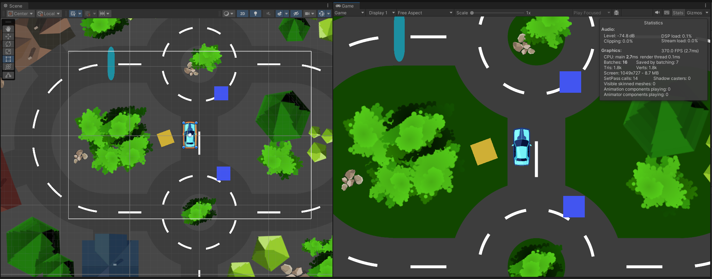

# Delivery Driver

Game made as part of the [Complete C# Unity Game Developer 2D](https://www.udemy.com/course/unitycourse/?couponCode=24T4MT90924B) tutorial series.

The game implements a simple package delivery mechanic, driving controls and a follow-camera:

Controls: WASD or ↑ ↓ ← →

Objective: Drive over the blue boxes to collect them and drop them off at the yellow box.

There is a boost gateway the doubles your speed unless you collide with any other game object.